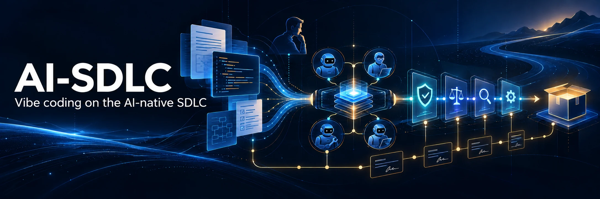

<p align="center">
  
</p>

# ai-sdlc — vibe coding on the AI-native SDLC

A plugin for **developers** that turns [The AI-Native SDLC Playbook](https://claude.com/resources/articles/the-ai-native-sdlc-playbook) into a working loop. In Claude Code or Codex, you describe what you want and use the shared skills to carry it through **intent → spec → plan → build/verify → review → ship**. Each stage commits an artifact that the next stage reads. Humans approve at the judgment points, with host-specific hook guardrails where supported.

> Code is no longer the bottleneck. Keep the speed of vibe coding, and add an audit trail, guardrails and a feedback loop.

## Install

```text
/plugin marketplace add tammai/ai-sdlc
/plugin install ai-sdlc@ai-sdlc
```
When the install dialog asks for a scope, pick **project** (this repo only) to try it out; **user** scope turns the plugin on in every repo you open.

### Codex

The shared skills are available from the Codex plugin package. For a local checkout, copy the checkout (including `.codex-plugin/`, `skills/`, `hooks/`, and `scripts/`) to `~/.codex/plugins/ai-sdlc`. Create `~/.agents/plugins/marketplace.json` with this entry:

```json
{
  "name": "ai-sdlc-local",
  "plugins": [
    {
      "name": "ai-sdlc",
      "source": { "source": "local", "path": "./.codex/plugins/ai-sdlc" },
      "policy": { "installation": "AVAILABLE", "authentication": "ON_INSTALL" },
      "category": "Developer tools"
    }
  ]
}
```

Run `codex plugin marketplace add ~/.agents/plugins`, then open Codex desktop, open the Plugins Directory, select **ai-sdlc-local**, and install **ai-sdlc**. After updating the checkout, copy it to the same plugin directory and restart Codex desktop. In Codex, invoke a skill with its `$skill-name` (for example, `$setup` or `$vibe`). The plugin points to the same `skills/` tree as Claude Code.

For Codex CLI, add the marketplace with the same command, then enable the plugin for a trusted project in `.codex/config.toml`:

```toml
[plugins."ai-sdlc@ai-sdlc-local"]
enabled = true
```

Restart Codex CLI in that project and invoke skills with `$skill-name`. Bundled lifecycle hooks are supported only for manually installed Codex desktop plugins; the CLI setup enables the shared skills, not these hooks.

Codex hook support is for manually installed Codex desktop plugins. Review and trust the bundled hooks in Codex before relying on them. Codex CLI skill use does not imply bundled hook coverage; this package does not claim CLI hooks. Codex's `PreToolUse` cannot force Claude Code's approval prompt: a guard result that would ask for approval is denied, with a reason to satisfy the workflow and retry. Codex hooks are best-effort and are not a security boundary.

Codex is a separate host and account surface. This repository does not route Codex to Claude models or use Claude subscription billing.

**Requirements:** git, and Node ≥ 18 for the plugin itself (hooks and CLI have zero dependencies). The app templates need Node ≥ 22.21 (see [Known limits](#app-templates-sdlc-scaffold-app)). `gh` is needed for PR flows.

**On Windows, the app templates also need:** a short project directory (see Known limits); Docker Desktop or WSL for the Go API's Postgres compose file; Rust with the MSVC build tools and WebView2 for the Tauri templates (their `clippy` and `cargo test` run only on Linux CI, so Windows and macOS Tauri builds are unverified); and the Flutter SDK for the Flutter template.

**Platforms:** the plugin's own tests run in CI on Linux, macOS and Windows (Node 18, 20, 22). Hooks run as `node …`, so `node` must be on the PATH of the host shell (with nvm/fnm/volta, start the host from a terminal where `node --version` works; if `node` is missing, the guards are off). Prefer Git for Windows (Git Bash) on Windows. The app templates have their own limits, below.

**No API key needed for the plugin itself.** In Claude Code, review, babysitting, triage and evals run in your own session. GitHub automation is opt-in via `/ai-sdlc:setup ci`, using a `claude setup-token` subscription token (or an API key). Codex uses the account and model configuration of the Codex host.

## Quick start

```text
/ai-sdlc:setup                                          # once per repo
/ai-sdlc:vibe add a claims status page for customers    # build a feature
/ai-sdlc:fix login fails when email has a plus sign     # fix a bug
/ai-sdlc:status                                         # where the change stands
```

`/ai-sdlc:setup` writes the config, `CLAUDE.md` and `REVIEW.md`, then adapts to the repo:
- **New repo:** asks for the stack (let Claude choose, or from templates), the apps (web, mobile, desktop, website) and the backend. See [Stacks](#stacks-ai-sdlcstack).
- **Existing repo:** keeps its stack and baselines the checks that already fail. See [Existing projects](#existing-projects).

`/ai-sdlc:vibe` is the main entry point. Give it an idea, or run it with no argument to resume the active change. It sizes the [risk tier](#risk-tiers-keep-it-light) and drives the change through the loop below, stopping for your approval at each judgment point.

Every stage writes a file under `docs/sdlc/`, so the chain is reviewable in git:

```text
docs/sdlc/
├── adr/                  # architecture decisions (tier L, stack choice)
└── <change-id>/
    ├── intent.md         # problem, outcome, constraints, tier
    ├── design.md, ui.md  # only when the change needs them
    ├── spec.md
    ├── plan.md
    ├── verify.md         # toolchain evidence
    └── review.md
```

You may see `sdlc` in the sections below. It is the plugin's CLI (`node scripts/sdlc.mjs`); Claude runs it for you, and you only type it yourself to approve, inspect or override. See [CLI](#cli).

## The loop

| Stage | Skill | Artifact | Human judgment | Enforced by |
|---|---|---|---|---|
| Intent | `intent` | `intent.md` (problem, outcome, systems, constraints, tier) | approve intent | — |
| Spec | `system-design`, `architecture`, `uiux`, `stack` → `spec` | `design.md` + ADRs (tier L), `ui.md` + `DESIGN.md` (UI work), then `spec.md` with policies applied while writing | approve design / UI direction / spec | CLI refuses spec approval until required design artifacts are approved |
| Plan, build | `plan` → `build` | `plan.md`, then code from a tier-routed implementer | approve plan | **plan gate** hook: no code edits until plan.md is approved |
| Verify | `build`, `fix` | `verify.md` toolchain evidence | — | **Stop** hook: can't finish with unverified edits; **test lock** during fixes |
| Review, ship | `review` → `ship` | `review.md`, PR with the chain | run relevant changes locally and report the result before review approval; code owner merges; release manager deploys | review skill records the manual check; **prod gate** (ask/deny, including pushes to main), secrets guard |
| Maintain | `triage` | a new `intent.md` (`source: monitor/incident/scan`) + eval | service owner triages | deterministic `sdlc detect` bands |

Design skills: `system-design` (capacity math against real stack limits, failure modes, adversarial `architect-reviewer`), `architecture` (ADR log in `docs/sdlc/adr/`), `uiux` (discovery interview, DESIGN.md contract, 2–3 directions, numeric craft rules, anti-slop list, capped polish loop, evidence-gated `ui-reviewer`).

Supporting skills: `learn` (if Claude makes the same mistake twice, the fix goes into CLAUDE.md), `policy` (encodes a standard as a skill plus a backstop), `status` (the chain plus playbook metrics).

### Risk tiers keep it light
- **S** (≤3 files, reversible): intent → plan → build → PR. No spec, no review.md.
- **M** (normal feature): the full chain.
- **L** (auth, payments, PII, migrations, breaking API, new stack): the full chain, tech-lead approvals, deep review, and an ADR.

### Claude Code model routing for subagents
| Complexity | When | Model / effort | Agents |
|---|---|---|---|
| simple | tier S | Sonnet / low | `implementer-simple`, `researcher-simple` |
| normal | tier M | Sonnet / high | `implementer`, `reviewer`, `researcher`, `verifier`, `architect-reviewer`, `ui-reviewer` |
| complex | tier L, or a risky step (`--complexity complex`) | Opus / medium | `implementer-complex`, `reviewer-complex`, `researcher-complex`, `architect-reviewer-complex`, `ui-reviewer-complex` |

For tier L, `sdlc route reviewer` overrides the table: the reviewer runs on a model different from the implementer's (see [Gates](#gates-and-how-strictly-they-apply)). With the default `crossModelReview.ladder` (an ordered list of models, `["opus","sonnet"]`) that means `reviewer` (Sonnet / high).

`sdlc route [role]` resolves the agent for the active change. Each role has one source definition in `agents-src/`. After editing one, regenerate the tier variants with `node scripts/build-agents.mjs`.

## Guardrails (hooks)
| Hook | What it does |
|---|---|
| PreToolUse `guard.mjs` | Blocks reads/writes of secret files and secret-looking strings; protected/generated paths; locked tests; code edits before plan approval; production commands (deploy to prod, `wrangler deploy`, `terraform apply`, push to main/force-push, store releases…) are `ask`, or `deny` with `prodGate: "deny"`; `RELEASE_APPROVAL=<ticket or approver>` in the launching shell lets them through |
| PostToolUse `post-edit.mjs` | Runs the file-scoped formatter; marks the change as having unverified edits |
| Stop `stop-gate.mjs` | Sends Claude back once to run `sdlc verify` before it reports done: when an edit tool touched the change, or when the working tree differs from the one the turn started on (so shell edits, formatters and codegen count too; the prompt hook records that baseline) |
| SessionStart `session-start.mjs` | Re-hydrates the active change and its next step |
| UserPromptSubmit `route-prompt.mjs` | Checks every message against the ai-sdlc skills and tells Claude which one to call (with a keyword hint and the active change's next step). Skipped for `/slash` commands; off with `"routePrompts": false` in `.sdlc/config.json` |

Codex runs these shared checks through `scripts/codex-hook.mjs`. Its `apply_patch` payload is parsed before the edit: touched paths and resulting content go through the same secret, protected-path, test-lock, approval, and plan checks; unknown or ambiguous patch syntax is denied. Codex prompt-required results become denials because its `PreToolUse` hook cannot open a Claude-style approval prompt. The Codex hook config covers shell and `apply_patch` calls; the separate desktop plugin trust step is required for those checks to run. The `sdlc route` table below describes Claude Code subagent routing, not Codex model selection.

**What's active where:**
- **Claude Code:** every plugin-enabled session gets the secrets guard and production-deploy prompt; repos set up with `/ai-sdlc:setup` also get verification, optional formatting, session summary and prompt routing.
- **Codex desktop:** only after the user trusts the plugin hooks; shell and patch tools get the Codex secrets and production checks. Set up the repository with `$setup` to enable plan/verify state-based checks, session summary and prompt routing. Prompt-required results are denials.
- **Only while a change is active:** the plan gate (`sdlc deactivate` turns it off for out-of-band edits).

## Gates and how strictly they apply
**Verify is incremental.** After a full pass, `sdlc verify` stores the git tree it passed on. The next run compares trees: nothing changed (docs and the artifact folder excluded, plus whatever is in `verifyIgnore`) → it finishes at once; something changed → it runs everything, or only the checks whose `paths` match a changed file. `--force` runs all. The Stop hook uses the same comparison, so ending a turn after only editing docs, or after reverting an edit, doesn't demand a re-run. Needs a git repo; without one it always runs everything.

**Approval is a human act.** `approvalGate` in `.sdlc/config.json` (default `["plan"]`; add `"intent"`, `"spec"`, `"review"`, or `[]` to turn off) makes the guard pause at the permission prompt in Claude Code for `sdlc approve <stage>`, for a hand-written `status: approved` in that stage's artifact, and for shell edits of it. Claude can't answer the prompt. In Codex, those prompt-required outcomes are denied with guidance to satisfy the workflow and retry; set `SDLC_APPROVER=<name>` in the launching environment only when pre-authorization is appropriate. The same text inside a command does nothing. Shell forgery detection is heuristic.

**`sdlc doctor`** says whether the hooks actually fire (the guard leaves a heartbeat before every tool call). If `node` is not on the PATH hooks run with, they fail silently and every guard is off; run it once after setup.

Two checks sit on the approval commands, next to the hooks. Each has a level, so a team can start gentle and tighten:

| Level | Behaviour |
|---|---|
| `off` | skipped |
| `advisory` | the finding is printed; approval goes through |
| `soft` (default) | approval is refused unless the human accepts the risk with `--override "<reason>"`; the reason is written into the artifact |
| `hard` | approval is refused, no override |

- **Definition of ready (`ready`).** `sdlc approve spec` and `sdlc approve plan` (the first check for tier S, which has no spec) wait until every open question in `intent.md` and every Concern in `spec.md` (a requirement the spec couldn't satisfy, or a policy conflict) is ticked: `- [ ] question — owner: PO` → `- [x] question → decision (by PO)`. Intent itself can still be approved with questions open. `sdlc ready` lists what is left; `sdlc status` shows `open:N`.
- **Reviewer independence (`independence`).** For tier L (`crossModelReview.tiers`), the reviewer must run on a different model than the implementer. `sdlc route` records which model was routed as implementer, picks the reviewer from `crossModelReview.ladder` (default `["opus","sonnet"]`: an opus implementer gets a sonnet reviewer), and stamps `implemented_by`, `reviewed_by` and `independence` into `review.md`. `approve review` refuses unless it says `cross-model`. Put a stronger model first in the ladder if you have one. If the main session implemented, pass `--implementer-model <m>`.

`sdlc gates` shows the levels; `sdlc gates set ready advisory` changes one. The plan gate and verify-on-stop hooks are unchanged (always hard when on).

## What stays human
Approving intent and spec (product owner), approving the plan (engineer or tech lead), merging the PR (code owner), deploying to production (release manager), and triaging maintenance findings (service owner). Agents generate and verify. They never approve their own work and never cross the production gate.

## Existing projects
Setup detects what's already there (`sdlc inspect`) and keeps it. It doesn't ask the new-app questions or restructure anything.
- **Verify commands** come from the project's own scripts (package.json, Makefile, go.mod, pubspec.yaml, pyproject.toml…), run with its own package manager (npm, pnpm, yarn or bun). It never adds a script the project doesn't define.
- **Stack profiles** only add protected generated paths that actually exist and deploy-gate patterns. Apps with no matching profile (Laravel, Django, Rails…) keep their own conventions.
- **The formatter** is off unless you agree.
- **`sdlc baseline`** marks checks that already fail as *known-red*. `sdlc verify` reports them but doesn't enforce them, so Claude is never pushed to fix a red build it didn't cause. Fix them as small changes and re-run `sdlc baseline` to start enforcing them.

## Stacks (`/ai-sdlc:stack`)
For a new app, setup asks three questions, plus a fourth when there is no backend yet:
1. **Stack:** **let Claude choose** what it's most confident building and verifying (the default), or build **from templates** (the team's stack).
2. **Apps:** web, mobile, desktop and/or a **website** (a static landing page or marketing site). A website alone needs no backend, so questions 3 and 4 don't apply.
3. **Existing API?** No (build the backend too) · yes, our own API we can change · yes, an API we don't control. Asked whenever there is an app, so everything except a website alone.
4. **Backend** (only when nothing exists): building from templates asks fullstack vs a separate Go API. When Claude chooses, it asks what the backend needs (payments/multi-tenant, jobs/integrations/reporting, scale/separate team, or a simple app) and decides from that.

After the stack is recorded and before the app is scaffolded, setup asks one more question for a new app: the **UI vibe**, meaning the app's visual style (not to be confused with `/ai-sdlc:vibe`, the command).
- **Vibe:** let Claude choose from what the app is (the default), or pick **Crisp & technical**, **Warm & friendly** or **Editorial & bold**. **Dark & atmospheric** (AI and media apps) is reached through Other or by inference, never as the default.
- **Brand anchor:** a hex colour, a font or a reference site switches to a custom palette on the nearest preset.
- The result goes into `DESIGN.md` (a `Vibe:` line, real colour, type, radius and motion values) and, when you scaffold, into the template's token files. The `uiux` skill reads it from then on and doesn't ask again. Existing projects are not asked.
- Presets and rules: `skills/uiux/references/vibes.md`. The decision model is borrowed from [Hallmark](https://github.com/nutlope/hallmark) (MIT); its landing-page catalog is not.

| Backend | From templates | Claude's choice (default) |
|---|---|---|
| **Fullstack**: the edge app is the backend | `edge-web-nuxt`: Nuxt 4 on Cloudflare Workers (D1/KV/R2, Drizzle) | `edge-web-hono-react`: Vite + React SPA and a Hono API in one Worker |
| **New separate backend**: a Go API owns accounts and sessions for every client | `spa-web-nuxt` (Nuxt `ssr:false` + passthrough Worker) + `go-api` | `spa-web-react` (Vite + React + passthrough Worker) + `go-api` |
| **Your own existing API** (you can change it) | `spa-web-nuxt` + passthrough Worker → your API (`--api-url`) | `spa-web-react` + passthrough Worker → your API |
| **Existing API** you don't control | `bff-web-nuxt`: the BFF keeps that API's tokens/keys server-side | `bff-web-next` |
| + Mobile | `flutter` | `expo` |
| + Desktop | `tauri-nuxt` next to a Nuxt web app (shares `packages/ui-layer`); `tauri-vue` when desktop is the only app | `tauri-react` |
| + Website | `site-landing-nuxt` or `site-marketing-nuxt` | the same: sites are Nuxt on both choices |

How the pieces fit:
- **No BFF in front of your own API.** The Go API sets an httpOnly session cookie for the web (with CSRF protection) and issues bearer tokens to mobile and desktop.
  - Sign-in methods: password, optional magic link, and OIDC providers. Native apps use PKCE.
  - The SPA reaches the API on its own origin through a Cloudflare Worker that only forwards `/api/*`.
  - The API runs on AWS, GCP, DigitalOcean or any VPS. A full BFF in front of your own API needs an ADR.
- **One UI framework per choice.** From templates it is Nuxt on the web (file routing, layouts, middleware, SSR off). Letting Claude choose gives Vite + React on the web and Tauri + React on desktop.
- **Desktop matches the web app (from templates).** When there's also a Nuxt web app, desktop is Nuxt and both extend a shared layer (theme, components, composables). Desktop on its own is Vite + Vue with file-based routing.
- **Override the UI framework** with `--ui vue|react|react-hono` on `sdlc stack`. `--ui react` on a fullstack app uses `edge-web-next` (Next.js on Cloudflare via OpenNext) in place of the Nuxt or Hono edge app.

`sdlc stack --choice … --surfaces … --backend …` records the decision in `.sdlc/stack.json`. It also merges each component's verify commands, protected generated paths, formatters and production-gate patterns into `.sdlc/config.json`.

## App templates (`sdlc scaffold-app`)
Setup offers to create the app from full, working templates in `templates/apps/`. Each template:
- is generated with the framework's official tooling;
- is pinned with a lockfile;
- ships one working **notes** feature (list and create, validation, empty, loading and error states, tests) to copy for real features.

| Template | What you get |
|---|---|
| `edge-web-nuxt` / `edge-web-next` / `edge-web-hono-react` | SPA + API on one Cloudflare Worker: D1 via Drizzle, KV and R2 bindings, tests on a local D1 |
| `spa-web-nuxt` / `spa-web-react` | Static SPA + a passthrough Worker (`/api/*` → Go API); sign-in screens driven by `/v1/auth/providers`; route guard; typed client from the contract |
| `go-api` | chi + oapi-codegen strict server, sqlc + pgx, goose, Postgres in Docker; auth with cookie sessions + bearer tokens, password (argon2id), magic link, OIDC with PKCE, refresh rotation with reuse detection, CSRF, rate limits; notes scoped per user |
| `bff-web-nuxt` / `bff-web-next` | BFF for an existing API: server-held session, CSRF check, typed client |
| `site-landing-nuxt` | Static landing site: Nuxt 4 SSG + Nuxt UI, home/about/contact/privacy, one place for copy and nav (`app/data/site.ts`), per-page SEO, sitemap, security headers. Served as static assets by a Cloudflare Worker (assets-only, no code per request); a broken internal link fails the build |
| `site-marketing-nuxt` | Static marketing site: the landing template plus Nuxt Content 3 (Markdown pages and a blog, frontmatter validated at build) and **media in R2**: a small Worker serves `/media/*` (GET/HEAD, ranges, ETag/304, colo cache, SVG sandboxed) while pages stay free static assets. Tests cover the Worker against a stub bucket and the content files |
| `flutter` / `expo` | Mobile client of the Go API: bearer tokens in secure storage, notes screens (Expo also: single-flight refresh, OIDC with PKCE, magic-link deep links) |
| `tauri-nuxt` / `tauri-vue` / `tauri-react` | Tauri v2 with Rust commands as the BFF, local SQLite, least-privilege capabilities, strict CSP, typed `invoke` wrapper |

`sdlc scaffold-app` copies the templates for the components in `.sdlc/stack.json`, then:
- fills in the app name;
- copies the shared `contracts/openapi.yaml`, `docker-compose.yml` and the Nuxt layer;
- installs, writes the verify commands, and adds stack notes to CLAUDE.md;
- runs verify.

On existing projects it only adds new components into empty folders. `.github/workflows/templates.yml` scaffolds and verifies the templates on Linux: only the ones a PR or push changed (all of them when shared scaffold code changes), and every template plus a web + desktop and a web + marketing-site combination weekly. It needs no Claude token.

Known limits:
- **Nuxt 4.6 templates need Node ≥ 22.21.** On older Node 22, `nuxt generate` fails.
- **Windows paths:** keep the project directory short on Windows, under about 100 characters. Node cannot read a `package.json` whose full path is 260 characters or more, even with `LongPathsEnabled`, so a deep `node_modules` breaks `vitest` and `nuxt generate` first; git itself fails near 200 characters of project root. Cloudflare's local runtime (workerd) and Expo's Hermes compiler have the same limit. WSL also works.
- **`nuxt generate` on native Windows:** Nitro 2.13 compares its `inline` list against Windows paths with backslashes, so Nuxt's own server runtime stayed external in the prerender build and every prerendered route returned `500 Server Error` ("Either manifest or precomputed data must be provided"). The Nuxt templates that prerender now carry `nitro.externals.inline` with a function matcher in `nuxt.config.ts`, which fixes it (`spa-web-nuxt` and `site-landing-nuxt` build and prerender on Windows). A project scaffolded before this fix needs the same line; Linux, macOS and WSL never had the problem. `tauri-nuxt` (Nuxt 4.4) is not affected.
- **Site templates** leave the account-side steps to a human: creating the R2 buckets, uploading real media, setting `NUXT_PUBLIC_SITE_URL` and the production deploy. They have no form backend (contact is a `mailto:` link) and no i18n or RSS. Nuxt Content indexes with Node's built-in `node:sqlite`, which Node ≥ 22.21 provides.
- **edge-web-next** builds on Linux, macOS or WSL. OpenNext needs symlinks, so on Windows without Developer Mode, run `pnpm build` in WSL.
- **flutter** was written without a local Flutter SDK; CI proves it on Linux. Its lockfile is created on first install.
- **The BFF templates' login** is a dev stub; replace it with your API's real auth.
- **go-api:** tests don't use `-race` (needs cgo). Rate limits are per instance; add edge rate limiting. There are no email-verification or password-reset endpoints yet.

## CLI
`node scripts/sdlc.mjs help`: `init · inspect · baseline · scaffold-app · scaffold · adr · stack · route · gates · ready · new · draft · approve · reject · reopen · status · activate · deactivate · verify · doctor · lock-tests · unlock-tests · close · metrics · detect`.

## Scaffolds (`sdlc scaffold …`)
`claude-md`, `review` (REVIEW.md), `evals` (worktree-isolated agent eval runner), `ci-evals`, `ci-review` (claude-code-action review + `@claude`), `ci-triage` (failed-build triage), `ci-monitor` (detect → diagnose → intent PR), `babysit-command`, `design-md` (DESIGN.md contract), `managed-settings` (regulated-org reference).

## Contributing

For working on ai-sdlc itself, see [CONTRIBUTING.md](CONTRIBUTING.md) (unit tests, evals and CI).

## License

MIT — see [LICENSE](LICENSE).

## Changelog

See [CHANGELOG.md](CHANGELOG.md).
