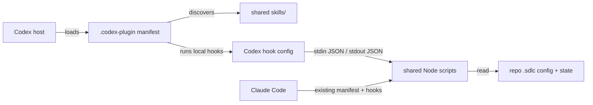

# System design: Codex plugin support

## 1. Requirements that shape the design
- Reuse the existing skill content and Node hook logic where possible.
- Preserve current Claude Code package behavior.
- Codex hook invocations complete within the existing 10 second hook timeout; the guard retains its 6 second internal budget.
- Secret and plan/test-lock denials must use a Codex-supported blocking response. Unsupported approval requests must not silently become allows.
- Codex `apply_patch` input must be parsed before execution to derive every touched path and added content. Unknown patch syntax is denied rather than skipped.
- Prompt-required Codex guard results are denied with a clear reason; no `ask` response is emitted by a Codex `PreToolUse` hook.
- Make the trust and platform limits visible before installation.

## 2. Load & capacity
This is local plugin metadata and local Node hooks. No service, datastore, network call, or shared runtime is added. Each hook invocation is bounded to 10 seconds by its manifest; the guard's existing internal budget is 6 seconds. Storage and request-rate capacity are not applicable.

| Quantity | Estimate | Math | Limit it must fit | Headroom |
|---|---:|---|---:|---|
| Guard execution | ≤6 s | Existing bounded scan budget | 10 s Codex hook timeout | ≥4 s |
| Plugin persistent data | 0 | No new persistent records | None | N/A |

## 3. Components & boundaries

- Codex manifest: compatibility metadata and references only; no duplicated skills.
- Claude manifest: unchanged and remains authoritative for Claude marketplace installation.
- Shared Node scripts: normalize/branch by hook runtime only where payload/output contracts differ; parse Codex `apply_patch` input before applying path/content rules.
- Codex hook file: event and matcher selection for Codex, separated from Claude hook matchers.
- Repo config/state: existing source of project settings; no new state schema.

## 4. Data
No new entities or external data. Hooks read the current repository's `.sdlc/config.json` and local state. Codex may expose the current prompt and patch command through hook input; scripts must never persist or print secret values.

## 5. Interfaces & contracts
- Codex plugin entry uses `.codex-plugin/plugin.json`, `skills: "./skills/"`, and a host-specific hook path.
- Hook input is one JSON object on stdin with `cwd`, `hook_event_name`, `tool_name`, and `tool_input` when tool-scoped. For Codex `Bash` and `apply_patch`, command content is at `tool_input.command`.
- Codex `apply_patch` calls provide the patch in `tool_input.command`; the guard and post-edit handler must parse the patch to find all edited paths and added content. Unknown formats are denied before execution.
- For Codex `PreToolUse`, use `permissionDecision: "deny"` for blocking outcomes. `"ask"` is unsupported. Map every Claude-style `ask` result in Codex to an explicit denial, including approval gates, production gates, parser uncertainty, timeout, and hook errors.
- `PermissionRequest` may allow, deny, or defer to Codex's native approval flow only when Codex is already raising an approval request; it cannot request approval for an arbitrary `PreToolUse` result.
- Codex `Stop` uses `decision: "block"` plus a reason to request a continuation for verification.
- Claude Code keeps the current hook schemas and marketplace config.

## 6. Key flows
1. **Skill invocation:** user installs the plugin → Codex discovers `skills/` → user invokes a skill or asks for a matching workflow → skill reads repo artifacts and calls the local `sdlc` CLI.
2. **Guarded tool call:** Codex invokes `PreToolUse` → shared guard reads Codex payload → parses `apply_patch` and normalizes all touched paths/content → denies secrets, protected files, test-lock edits, unapproved-plan edits, production actions, and uncertain results using Codex's response.
3. **Verify reminder:** Codex ends a turn → Stop hook checks the active change's verification state → returns a Codex continuation response when code remains unverified.

## 7. Consistency, concurrency & transactions
None. Hooks are synchronous local checks. State writes continue to use the existing atomic local-state helper. A hook failure must not be represented as an allow; the runtime-specific adapter should return a safe block or leave Codex's native permission flow undecided according to the event contract.

## 8. Failure modes
| Failure | Detection | User impact | Mitigation / degradation | Recovery |
|---|---|---|---|---|
| Plugin hook not trusted | Codex install UI skips bundled hooks | Skills load but automatic guardrails do not run | Installation docs call out trust step and remaining limits | Review/trust current hooks in Codex |
| `ask` output unsupported | Codex hook docs | Claude-style approval gates cannot be reproduced uniformly | Convert prompt-required Codex guard outcomes to deny; do not emit unsupported `ask` | Satisfy the workflow and retry, or configure release approval in the launching environment |
| Unknown Codex patch payload | Patch parser cannot safely derive paths/content | Edit could bypass secrets, protected-path, plan, or test-lock checks | Deny the patch before execution | Update parser after checking the current official schema |
| Hook timeout | Runtime timeout / guard budget | Hook may not complete | Keep bounded scans and existing budgets | Review action manually; reduce scan scope if needed |
| Codex CLI does not load bundled hooks | Host/platform behavior | Skills work without automatic hooks | Document CLI hook coverage as unsupported until confirmed | Install hooks through a supported local configuration, if user chooses |

## 9. Security & privacy
- Trust boundary: plugin code runs locally with host-provided permissions after the user reviews and trusts the hook definition.
- Keep secret-path and secret-content checks deterministic. Do not dump hook stdin, tool content, or credentials in logs.
- Codex's currently documented hook behavior is an additional guardrail, not an enforcement boundary. Users can disable/untrust hooks, and some tool paths may bypass hooks.
- Project-specific human approval remains a workflow requirement, but forced prompt parity is not guaranteed in Codex.

## 10. Observability & operations
No service telemetry is added. Existing hook heartbeats and local verification state remain unchanged. README troubleshooting lists the Codex trust step, Node requirement, supported Codex surfaces, and differences from Claude.

## 11. Evolution
If Codex adds a supported forced-ask result or broadens plugin hook coverage to CLI, update the Codex adapter/config and installation documentation. The shared skill source remains stable. This first integration changes only manifests, host wiring, documentation, and payload handling, so no ADR is required.

## 12. Alternatives & decisions
- **Duplicate all skills under a Codex directory:** rejected; it creates drift. Use the existing `skills/` tree.
- **Reuse `hooks/hooks.json` unchanged:** rejected; Claude-specific matchers and ask responses do not match Codex's hook contract. Keep a Codex-specific hook file and shared handlers.
- **Claim full parity:** rejected; official hook docs identify unsupported hook decisions and trust requirements. State the limits explicitly.

## Design review
- **Critical — `apply_patch` bypassed existing edit checks:** resolved by requiring a Codex patch parser in pre- and post-edit hooks; derive every touched path/content; deny unknown patch formats.
- **Important — Codex `PreToolUse` cannot return `ask`:** resolved by mapping prompt-required outcomes and guard uncertainty to a Codex denial. `PermissionRequest` is used only when Codex has already raised an approval request.
- Residual risk: an untrusted or disabled hook, or a tool path Codex does not route through lifecycle hooks, remains outside these checks.
